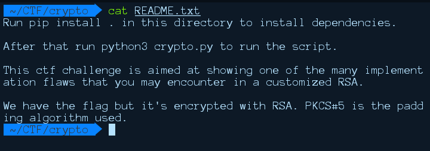
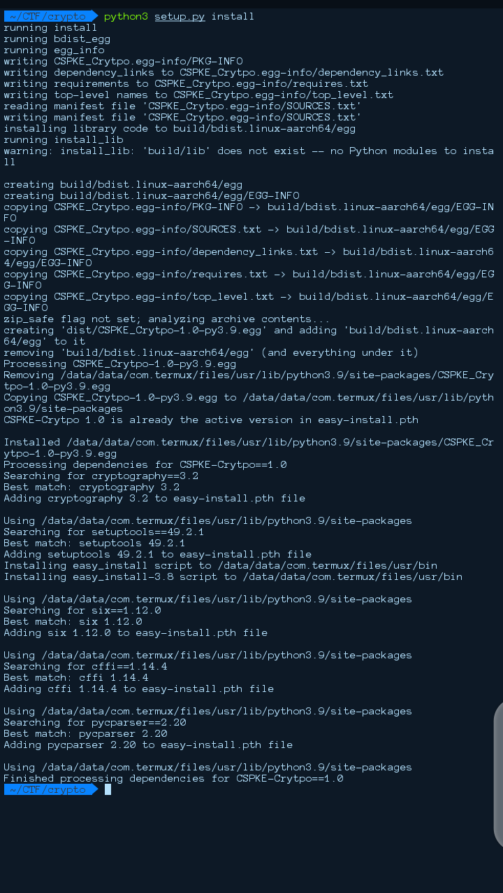
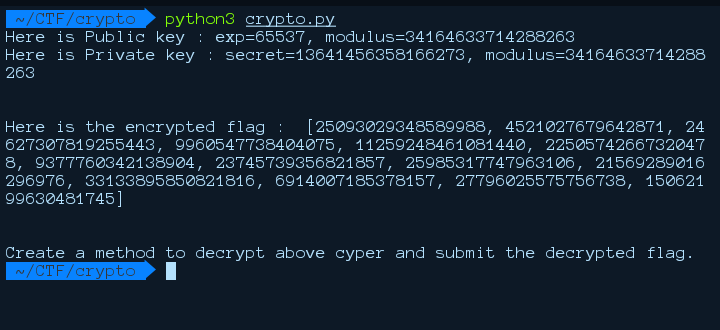
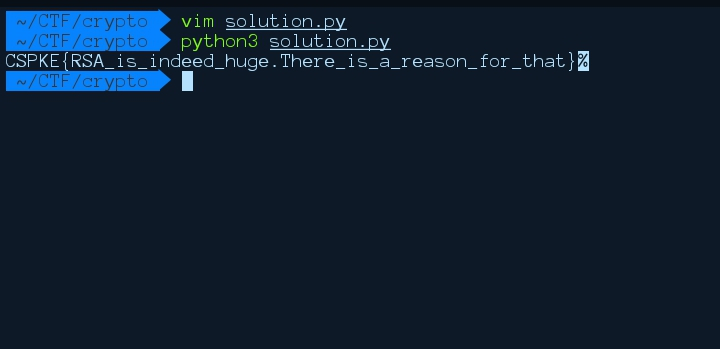

+++
title = "CyberSpaceKE the CSPKE CryptoFREE Vault Writeup"
date = 2021-03-09T13:04:22+03:00
draft = false
tags = ['CTF', 'cryptography']
+++

## Introduction

We had an awesome CTF competition which was hosted by CyberSpaceKe that was held at Afralti Conference & Guest House located in Nairobi Kenya. There were a number of challenges to tackle within the 12 hours that the CTF was live, although am going to cover on how I solved the crypto challenge only, on this writeup.

## Additional Resources

Firstly, we have to know how RSA works since the challenge was based on the RSA concept. A comprehensive description on how RSA works can be found <a href="https://en.wikipedia.org/wiki/RSA_(cryptosystem)">here</a>.

## Solution

For this challenge we are provided with a .zip file

on extracting the crypto.zip, we get three files, a README.txt, setup.py and crypto.py

My first step was to read the content of the readme file but it did not explain much. It only explained the padding method used and how to install the dependencies and how to run the script XD


My next move was to run the setup.py `python3 setup.py install` that installs the packages needed for the challenge.


let's dive into the actual challenge ;p

running the crypto.py, we are provided with public key, private key and the encrypted flag.. "easy one" XD


we are provided, with the `exponent`, `modulus` and the `secret(private key)` which makes decrypting the flag even more easy

in RSA; m(message) = ( c ^ d ) % n

This can be represented using the pow method in python as `m = pow(c, d, n)`

where:

C is the ciphertext in our case the ecrypted flag

d is the private key;the secret value that was provided from the script

n is the modulus

Since we have all the values that are needed, I decided to write a python script to decrypt the flag and convert the values into text

```python
import binascii

modulus = 34164633714288263
privateKey = 13641456358166273
encryptedFlag = [25093029348589988, 4521027679642871, 24627307819255443, 9960547738404075, 11259248461081440, 22505742667320478, 9377760342138904, 23745739356821857, 25985317747963106, 21569289016296976, 33133895850821816, 6914007185378157, 27796025575756738, 15062199630481745]

flag = []

for c in encryptedFlag:
    message = pow(c, privateKey, modulus)
    flag.append(message)

flag = [hex(i) for i in flag]

final = [str(i)[2:] for i in flag]
for i in final:
    try:
        print(binascii.unhexlify(i).decode(), end="")
    except:
        pass
```

on running the script, we get the flag;p

