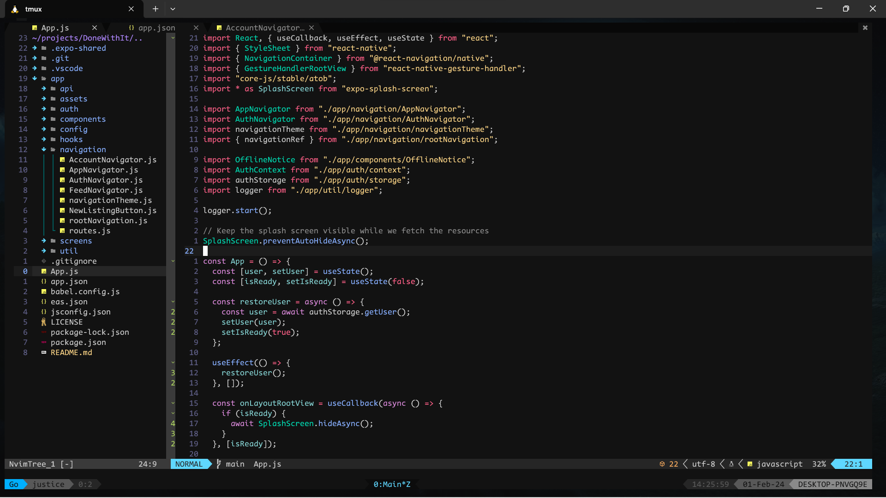

+++
title = "My Neovim Configuration Setup Guide"
date = 2024-01-16T13:32:33+03:00
draft = false
tags = ['lua', 'neovim']
+++

## Introduction

Welcome to my Neovim configuration! Follow these steps to set up and enhance your Neovim experience.


## Prerequisites

Before diving into the configuration, ensure you have the following prerequisites installed:

1. **Ensure you have Neovim v0.9 and Above:**
   Ensure that you have Neovim version 0.9 or above installed. Check your Neovim version using:

   ```bash
   nvim --version
   ```

2. **Install python3.10-venv:**
   Install the `python3.10-venv` package using the following command:

   ```bash
   sudo apt install python3.10-venv
   ```

3. **Node Packages:**
   Install neovim and tree-sitter node packages by running the following command:

   ```bash
   npm i -g neovim tree-sitter
   ```

4. **pynvim Package:**
   Install the pynvim package using pip:

   ```bash
   pip install -U pynvim
   ```

   Ensure that the `python` command points to `python3` by adding the following alias on your `.bashrc` or `.zshrc`:

   ```bash
   alias python=python3

   ```

5. **Clone Configuration Repository:**
   Clone my Neovim configuration repository to `~/.config/nvim`:

   ```bash
   git clone https://github.com/justicenyaga/my_nvim_config.git ~/.config/nvim
   ```

6. **_For WSL users_, Download win32yank to interact with windows clipboard:**

   Download win32yank binary here [https://github.com/equalsraf/win32yank/releases](https://github.com/equalsraf/win32yank/releases)
   then copy it to `/usr/local/bin`

   Add execution permissions

   ```bash
   chmod +x win32yank.exe
   ```

   Uninstall `xclip` if you have it installed to avoid potential conflit as it would be used as the default:

   ```bash
   sudo apt remove xclip
   ```

## Neovim Plugin Installation

1. **Open Neovim:**

   ```bash
   nvim
   ```

2. **Allow the plugins to load.**

   You can issue the command `:Lazy` to view the progress

   Once the plugins are installed, exit Neovim.

3. **Compile the ES7/Javascript/React snippets plugin:**

   ```bash
   cd ~/.local/share/nvim/lazy/vscode-es7-javascript-react-snippets
   yarn install --frozen-lockfile && yarn compile
   ```

   This step is crucial for the proper functioning of the snippets plugin.

4. **Customize Your Language Server Protocol (LPS), Linters, and Formatters Installation:**

   Open up Mason using the command `:Mason` to seamlessly install and configure your preferred Language Server Protocol, along with Linters and Formatters. Tailor these tools to your specific needs, providing a customized and optimized setup for an enhanced coding experience.

5. **_For WSL users_: To interact with system clipboard**, uncomment the wsl clipboard block on `~/.config/nvim/lua/justice/core/options.lua`

   ```lua
   -- vim.g.clipboard = {
   --   name = "win32yank-wsl",
   --   copy = {
   --     ["+"] = "win32yank.exe -i --crlf",
   --     ["*"] = "win32yank.exe -i --crlf",
   --   },
   --   paste = {
   --     ["+"] = "win32yank.exe -o --lf",
   --     ["*"] = "win32yank.exe -o --lf",
   --   },
   --   cache_enabled = true,
   -- }
   ```

That's it! Your Neovim environment is now configured and ready for use. Customize further based on your preferences, and happy coding!

<br/>

## Recommendations

Congratulations on setting up your Neovim environment! If you're looking to further enhance your terminal experience, I highly recommend checking out my tmux configuration post linked below. Tmux is a powerful terminal multiplexer that allows you to organize and manage multiple terminal sessions effortlessly.



Discover how to optimize your workflow, split your terminal into panes, and efficiently navigate through different sessions. Tmux can significantly boost your productivity and provide a seamless terminal experience alongside your Neovim setup.

Happy coding, and may your terminal sessions be ever productive!
