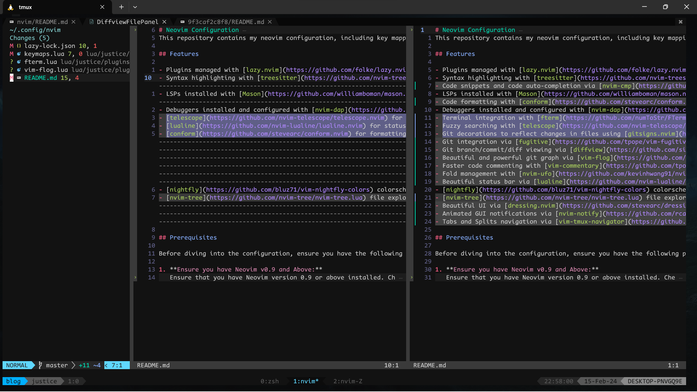
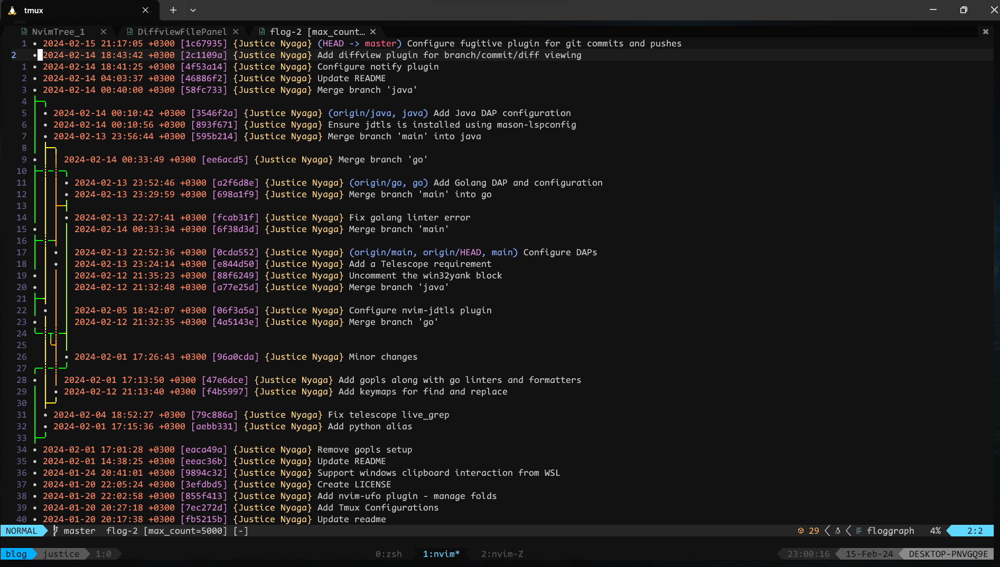
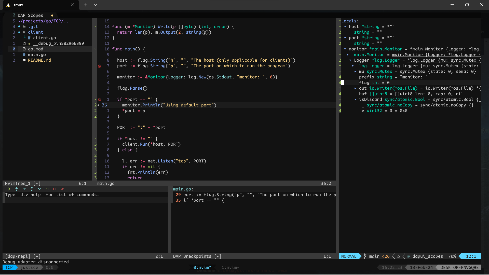

+++
title = "My Neovim Configuration Setup Guide"
date = 2024-01-16T13:32:33+03:00
draft = false
tags = ['lua', 'neovim']
series = ["My Neovim Configuration"]
series_order = 1
+++

## Introduction

Welcome to my Neovim configuration repository, where I've curated a powerful setup tailored for developers working with Node.js, React, Python, Golang, and Java.

## Screenshots








## Features

- Plugins managed with [lazy.nvim](https://github.com/folke/lazy.nvim)
- Syntax highlighting with [treesitter](https://github.com/nvim-treesitter/nvim-treesitter)
- Code snippets and code auto-completion via [nvim-cmp](https://github.com/hrsh7th/nvim-cmp)
- LSPs installed with [Mason](https://github.com/williamboman/mason.nvim) and configured using [lspconfig](https://github.com/neovim/nvim-lspconfig)
- Code formatting with [conform](https://github.com/stevearc/conform.nvim)
- Debuggers installed and configured with [nvim-dap](https://github.com/mfussenegger/nvim-dap)
- Terminal integration with [fterm](https://github.com/numToStr/FTerm.nvim)
- Fuzzy searching with [telescope](https://github.com/nvim-telescope/telescope.nvim)
- Git decorations to reflect changes in files using [gitsigns.nvim](https://github.com/lewis6991/gitsigns.nvim)
- Git integration via [fugitive](https://github.com/tpope/vim-fugitive)
- Git branch/commit/diff viewing via [diffview](https://github.com/sindrets/diffview.nvim)
- Beautiful and powerful git graph via [vim-flog](https://github.com/rbong/vim-flog)
- [friendly-snippets](https://github.com/rafamadriz/friendly-snippets) and [VS Code ES7](https://github.com/r5n-dev/vscode-react-javascript-snippets) snippets
- Faster code commenting with [Comment.nvim](https://github.com/numToStr/Comment.nvim)
- Quicky add/delete/change delimiter pairs with[nvim-surround](https://github.com/kylechui/nvim-surround)
- Fold management with [nvim-ufo](https://github.com/kevinhwang91/nvim-ufo)
- Beautiful status bar via [lualine](https://github.com/nvim-lualine/lualine.nvim)
- [nightfly](https://github.com/bluz71/vim-nightfly-colors) colorscheme
- [nvim-tree](https://github.com/nvim-tree/nvim-tree.lua) file explorer with [nvim-web-devicons](https://github.com/nvim-tree/nvim-web-devicons) for the icons
- Beautiful UI via [dressing.nvim](https://github.com/stevearc/dressing.nvim)
- Animated GUI notifications via [nvim-notify](https://github.com/rcarriga/nvim-notify)
- Tabs and Splits navigation via [vim-tmux-navigator](https://github.com/christoomey/vim-tmux-navigator)

## Prerequisites

Before diving into the configuration, ensure you have the following prerequisites installed:

### 1. **Ensure you have Neovim v0.9 and Above:**

Ensure that you have Neovim version 0.9 or above installed. Check your Neovim version using:

```bash
nvim --version
```

### 2. **Install python3.10-venv:**

Install the `python3.10-venv` package using the following command:

```bash
sudo apt install python3.10-venv
```

### 3. **Install Go (Golang):**

Certain plugins in my configuration rely on Go. Ensure a seamless experience by installing Go using the official [installation guide](https://go.dev/doc/install).

After installation, set up the required environment variables in your shell configuration file (e.g., `.bashrc` or `.zshrc`):

```bash
export GOPATH=~/go
export GOROOT=/usr/local/go
export PATH=$PATH:/usr/local/go/bin
export PATH=$PATH:~/go/bin
```

### 4. **Node Packages:**

Install neovim and tree-sitter node packages by running the following command:

```bash
npm i -g neovim tree-sitter
```

### 5. **pynvim Package:**

Install the pynvim package using pip:

```bash
python3 -m pip install -U pynvim
```

Ensure that the `python` command points to `python3` by adding the following alias on your `.bashrc` or `.zshrc`:

```bash
alias python=python3

```

### 6. **Telescope requirements:**

For telescope to work without any issues, you need to have both ripgrep and fd packages. Install them using:

```bash
sudo apt install ripgrep fd-find
```

### 7. **_Optional:_ Go Language Server (gopls):**

For Go developers, consider installing the Go Language Server (gopls) to enhance your Go programming experience. Run the following command:

```bash
go install golang.org/x/tools/gopls@latest
```

### 8. **_Optional:_ Java**

For Java developer, follow the following steps:

- Ensure you are running JRE 17 and above
  ```bash
  java --version
  ```
- Ensure `JAVA_HOME` environment variable points to the JDK directory. Identify the correct path using:
  ```bash
  sudo update-alternatives --config java
  ```
  Set `JAVA_HOME` in your `.bashrc` or `.zshrc`:
  ```bash
     export JAVA_HOME=/path/to/openjdk
  ```
  For example:
  ```bash
  export JAVA_HOME=/usr/lib/jvm/java-21-openjdk-amd64
  ```
- Download and extract a snapshot build from [http://download.eclipse.org/jdtls/snapshots/](http://download.eclipse.org/jdtls/snapshots/) using:
  ```bash
  wget https://download.eclipse.org/jdtls/snapshots/jdt-language-server-1.31.0-202312211634.tar.gz && sudo tar -C /usr/local -xzf jdt-language-server-1.31.0-202312211634.tar.gz
  ```

### 9. **Clone Configuration Repository:**

Clone my Neovim configuration repository to `~/.config/nvim`:

```bash
git clone https://github.com/justicenyaga/my_nvim_config.git ~/.config/nvim
```

### 10. **_Optional:_ win32yank for WSL**

For WSL users, install `win32yank` for clipboard interaction between Windows and WSL by following these steps:

1. **Download win32yank binary:**

   - Visit [https://github.com/equalsraf/win32yank/releases](https://github.com/equalsraf/win32yank/releases) to download the `win32yank` binary.

2. **Copy it to `/usr/local/bin`:**

   - After downloading the binary, copy it to the `/usr/local/bin` directory.

3. **Add execution permissions:**

   - Set execution permissions for `win32yank.exe` using the following command:
     ```bash
     chmod +x win32yank.exe
     ```

4. **Uninstall `xclip` and `xsel`:**
   - To avoid potential conflicts, uninstall `xclip` and `xsel` if they are installed on your system as they would be used by default.
     ```bash
     sudo apt remove xclip
     sudo apt remove xsel   # if it exists
     ```

These steps ensure the proper installation and configuration of `win32yank` as the default clipboard tool, avoiding conflicts with `xclip` and/or`xsel`.

## Neovim Plugin Installation

### 1. **Open Neovim:**

```bash
nvim
```

### 2. **Allow the plugins to load.**

You can issue the command `:Lazy` to view the progress

Once the plugins are installed, exit Neovim.

### 3. **Language Servers Customizations:**

To add more language servers and debug adapters to the ones I've configured, check out the [lsp server](https://github.com/neovim/nvim-lspconfig/blob/master/doc/server_configurations.md), [linters](https://github.com/mfussenegger/nvim-lint?tab=readme-ov-file#Usage), [formatters](https://github.com/stevearc/conform.nvim#Setup) and [debug adapter](https://github.com/mfussenegger/nvim-dap/wiki/Debug-Adapter-installation) configuration guides.

You can use `Mason` (opened with the command `:Mason`) to seamlessly install the configured servers. You can also use Mason to ensure certain servers, formatters, linters, and DAPs are installed. Check out the [mason-lspconfig](https://github.com/williamboman/mason-lspconfig.nvim#Configuration), [mason-tool-installer](https://github.com/WhoIsSethDaniel/mason-tool-installer.nvim#Configuration) and [mason-nvim-dap](https://github.com/jay-babu/mason-nvim-dap.nvim#Configuration) configuration guides for more information on this.

### 4. **Language Parsers Customizations:**

I've employed `nvim-treesitter` to customize language parsers. Explore their [list of supported languages](https://github.com/nvim-treesitter/nvim-treesitter?tab=readme-ov-file#supported-languages). To integrate a new language parser, just include it in the `ensure_installed` object within the `nvim-treesitter` configuration file (`~/.config/nvim/lua/justice/plugins/nvim-treesitter.lua`). `treesitter` will handle the automatic installation of parsers specified in the `ensure_installed` section.

### 5. **_Optional_: Copilot auto-completion**

- To use copilot auto completion, you need to have a github copilot subscription.
- Authenticate to Copilot using `:Copilot auth` command.

### 6. **_For Java Developers:_**

Download and setup the `java-debug` extension. Install it on your neovim data folder `~/.local/share/nvim` using the following commands:

```bash
git clone https://github.com/microsoft/java-debug.git ~/.local/share/nvim/java-debug
cd ~/.local/share/nvim/java-debug
./mvnw clean install
```

### 7. **_For Non-WSL users_:**

Comment the wsl clipboard block on `~/.config/nvim/lua/justice/core/options.lua` if you are not using WSL.

```lua
vim.g.clipboard = {
  name = "win32yank-wsl",
  copy = {
    ["+"] = "win32yank.exe -i --crlf",
    ["*"] = "win32yank.exe -i --crlf",
  },
  paste = {
    ["+"] = "win32yank.exe -o --lf",
    ["*"] = "win32yank.exe -o --lf",
  },
  cache_enabled = true,
}
```

## Conclusions

That's it! Your Neovim environment is now configured and ready for use. Customize further based on your preferences, and happy coding!



Navigate to the next article in this series via the blue drop-down list at the end/beginning of this page for a detailed walkthrough of the keymaps configured in my Neovim setup.



## Recommendations

Congratulations on setting up your Neovim environment! If you're looking to further enhance your terminal experience, I highly recommend checking out my tmux configuration post linked below. Tmux is a powerful terminal multiplexer that allows you to organize and manage multiple terminal sessions effortlessly.



Discover how to optimize your workflow, split your terminal into panes, and efficiently navigate through different sessions. Tmux can significantly boost your productivity and provide a seamless terminal experience alongside your Neovim setup.

Happy coding, and may your terminal sessions be ever productive!
