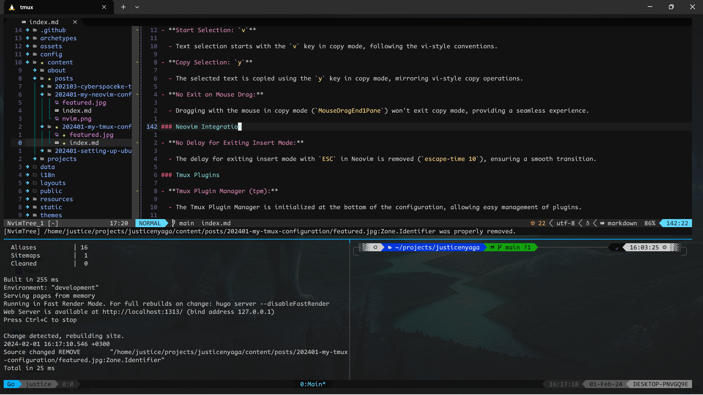

+++
title = "My Tmux Configuration: Elevating Your Terminal Experience"
date = 2024-01-20T14:47:38+03:00
draft = false
tags = ['tmux', 'tpm', 'vim-tmux-navigator', 'tmux-themepack', 'tmux-resurrect', 'tmux-continuum', 'neovim']
+++

## Introduction

Welcome to the world of Tmux, where terminal multitasking becomes a breeze. In this guide, we'll walk through setting up and enhancing your Tmux experience with a customized configuration.

Designed for efficient integration with Neovim, this carefully crafted configuration aims to streamline your terminal workflow. It provides a seamless and productive environment for both Tmux and Neovim enthusiasts. Whether you're a seasoned user or just diving into the world of terminal customization, this guide will help you unlock the full potential of Tmux in conjunction with Neovim. Let's dive in!



## Configuration Setup Step

Follow these steps to set up and enhance your Tmux experience:

1. **Install Tmux:**

   If Tmux is not already installed on your system, you can install it using your package manager. For example, on Debian-based systems, run:

   ```bash
   sudo apt-get install tmux

   ```

   Verify the installation by checking the Tmux version:

   ```bash
   tmux -V
   ```

2. **Retrieve the Configuration File:**

   Download the Tmux configuration file and seamlessly integrate it into your home directory using the following command:

   ```bash
   wget https://raw.githubusercontent.com/justicenyaga/my_nvim_config/main/.tmux.conf -O ~/.tmux.conf

   ```

3. **Install Tmux Plugin Manager (tpm):**

   Clone the Tmux Plugin Manager repository to your local machine:

   ```bash
   git clone https://github.com/tmux-plugins/tpm ~/.tmux/plugins/tpm
   ```

4. **Create a Tmux session:**

   Start a new Tmux session with a specific name (replace `SessionName` with your desired name):

   ```bash
   tmux new -s SessionName
   ```

   This should create a session and attach you to the created session.

5. **Reload the Tmux configuration file:**

   Press your Tmux prefix key (the configuration file uses `Ctrl + N`) followed by `r` to reload the configuration file:

   ```bash
   <C-n>r
   ```

   
   On the configuration file, replace `C-n` with a prefered key bind to override the default prefix key bind, on the following lines:

   ```bash
   set -g prefix C-n
   bind-key C-n send-prefix
   ```

   

6. **Install Tmux plugins:**

   While inside a Tmux session, install plugins by pressing your Tmux prefix key followed by `I` (uppercase):

   ```bash
   <C-n>I
   ```

   
   Again, replace `<C-n>` with your configured prefix key bind.
   

That's it! Your Tmux environment is now configured with the specified settings and plugins. Customize further based on your preferences.

## Usage

### Keybinds Explanation

- **Prefix Key: `C-n`**

  - The prefix key is set to `C-n` for easier accessibility and to avoid conflicts with the default `C-b`. It's a comfortable and ergonomic choice.

- **Vertical Split: `prefix + |`**

  - The keybind for vertical split is set to `prefix + |` for better visualization. The vertical bar (`|`) visually represents a vertical split, making it intuitive and memorable.

- **Horizontal Split: `prefix + -`**

  - Horizontal split is initiated with `prefix + -`, providing a straightforward and balanced key combination for creating horizontal panes.

- **Reload Configuration: `prefix + r`**

  - Reloading the configuration is done with `prefix + r`, making it quick and easy to apply any changes made to the configuration file.

- **Resize Panes: `prefix + j/k/l/h`**

  - Resizing panes is streamlined with `prefix + j/k/l/h` for downward, upward, right, and left respectively. The mnemonic association with arrow keys makes it intuitive.

- **Maximize Pane: `prefix + m`**

  - The keybind `prefix + m` maximizes the active pane, providing a convenient way to focus on one task at a time.

- **Enable Mouse Mode: `prefix + M`**

  - Mouse mode is toggled with `prefix + M`, allowing for easy resizing and scrolling using the mouse.

### Copy Mode and Selection

- **Enter Copy Mode: `prefix + [`**

  - Copy mode is entered with `prefix + [`, initiating vi-style selection for efficient copying of text.

- **Start Selection: `v`**

  - Text selection starts with the `v` key in copy mode, following the vi-style conventions.

- **Copy Selection: `y`**

  - The selected text is copied using the `y` key in copy mode, mirroring vi-style copy operations.

- **No Exit on Mouse Drag:**

  - Dragging with the mouse in copy mode (`MouseDragEnd1Pane`) won't exit copy mode, providing a seamless experience.

### Neovim Integration

- **No Delay for Exiting Insert Mode:**

  - The delay for exiting insert mode with `ESC` in Neovim is removed (`escape-time 10`), ensuring a smooth transition.

### Tmux Plugins

- **Tmux Plugin Manager (tpm):**

  - The Tmux Plugin Manager is initialized at the bottom of the configuration, allowing easy management of plugins.

- **List of Plugins:**

  - - [vim-tmux-navigator](https://github.com/christoomey/vim-tmux-navigator): Navigate seamlessly between Vim and Tmux panes.
    - [tmux-themepack](https://github.com/jimeh/tmux-themepack): A collection of themes for Tmux.
    - [tmux-resurrect](https://github.com/tmux-plugins/tmux-resurrect): Persist Tmux sessions after computer restart.
    - [tmux-continuum](https://github.com/tmux-plugins/tmux-continuum): Automatically save sessions every 15 minutes.

- **Theme: Powerline Cyan**

  - The chosen theme from tmux-themepack is `powerline/default/cyan` for a visually appealing and distinctive look.

Remember to customize these keybinds further based on your preferences and workflow!
