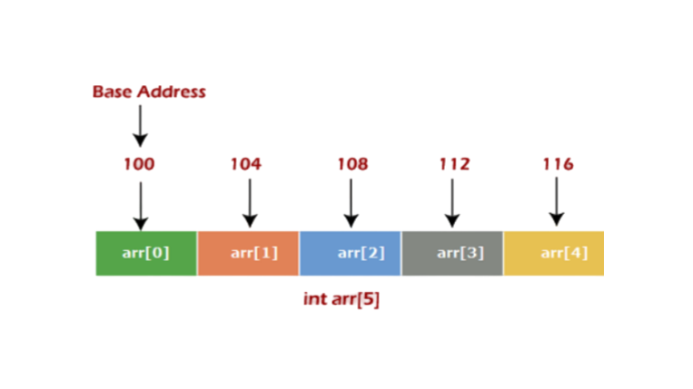
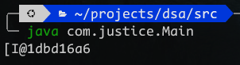

+++
title = "Arrays Data Structure"
date = 2024-02-11T22:39:33+03:00
draft = false
tags = ["data-structures-and-algorithms", "arrays", "java"]
series = ["Data Structures and Algorithms"]
series_order = 2
+++

## Introduction

Arrays stand as one of the fundamental data structures, serving as a go-to choice for storing a sequence of items, be it strings, numbers, objects, or any other data type.

The effectiveness of arrays stems from their sequential storage in memory, as illustrated below:



Consider an array of 5 integers, with the first item residing at memory address 100. Each subsequent item is placed in addresses like 104, 108, and so forth, given that integers in Java occupy 4 bytes each.

The efficiency of array indexing shines through with a constant runtime complexity of `O(1)`. This simplicity arises from the direct calculation of memory addresses, free from loops or intricate logic. If your goal is to store a list of items and access them by index swiftly, arrays emerge as the optimal choice.

## Limitations of Arrays

### Static Nature

Arrays, in Java and many other languages, have a fixed size. When you create an array, you have to decide how big it will be, and you can't change it later. This becomes a problem when you don't know exactly how many items you need. Guessing too high wastes memory because some spaces are never used. On the other hand, guessing too low means the array quickly gets filled up, and you have to resize it. Unfortunately, resizing has a cost, taking more time as the array gets bigger. This process is known as a runtime complexity of `O(n)`.

### Removal Operations

While removing the last item from an array is easy and quick (`O(1)` time), things get more complicated when removing an item at the beginning. In this case, all items to the right of the removed one need to shift to the left 1 position to fill the gap. The bigger the array, the more time it takes to do this. As a result, the worst-case runtime complexity for removing an item at the beginning is `O(n)`.

Understanding these details helps developers make smart choices about using arrays, thinking about both their benefits and drawbacks when creating efficient algorithms and data structures.

## Working with Arrays in Java

When working with arrays in Java, you declare them using the following syntax:

```java
int[] variable_name = new int[3];
```

This statement declares an array that will store items of the integer type, with a size of 3, meaning it can only store 3 items. The `variable_name` is a variable that points to the memory address of the array.

To print the value of `variable_name`, it will display the array hash code along with the array type, i.e., the data type the array is storing.

```java
public class Main{
    public static void main(String[] args) {
        int[] variable_name = new int[3];
        System.out.println(variable_name);
    }
}
```

Output:


The `[` Indicates its an array the `I` is the data type and the value after the `@` is the array hash code.

To print the actual items in the array, you can use the `Arrays` class from the `java.util` package and the `toString` method to convert the array to a string.

```java
import java.util.Arrays;

public class Main{
    public static void main(String[] args) {
        int[] variable_name = new int[3];
        System.out.println(Arrays.toString(variable_name));
    }
}
```

This will print `[0, 0, 0]` because when declaring arrays using this method, the array is instantiated with default values. For integers, the default value is 0.

To change the values of items in the array, you use their index as shown below:

```java
import java.util.Arrays;

public class Main{
    public static void main(String[] args) {
        int[] variable_name = new int[3];
        variable_name[0] = 10;
        variable_name[1] = 20;
        variable_name[2] = 30;
        System.out.println(Arrays.toString(variable_name));
    }
}
```

The line `variable_name[0] = 10;` sets the value of the first item to 10, and so on.

If you know the items you are going to store in the array ahead of time, there is a shorter and cleaner way to initialize the array:

```java
import java.util.Arrays;

public class Main{
    public static void main(String[] args) {
        int[] variable_name = { 10, 20, 30 };
        System.out.println(Arrays.toString(variable_name));
        System.out.println(variable_name.length);
    }
}
```

This method declares and initializes the array with the values provided in the braces, setting the size of the array to the number of items in the braces, which, in this case, is 3 and cannot be changed.

If you want to add another item to the array, you need to create a new array with a larger size, then copy the items from the old array and add the new item.

```java
import java.util.Arrays;

public class Main{
    public static void main(String[] args) {
        int[] variable_name = { 10, 20, 30 };

        int[] numbers = new int[4];
        for (int i = 0; i < variable_name.length; i++)
            numbers[i] = variable_name[i];

        numbers[3] = 40;
        System.out.println(Arrays.toString(variable_name));
    }
}
```

This limitation of arrays in Java leads to the need for dynamic arrays or lists. If you want to work with lists that grow or shrink automatically, you would use linked lists.

## Exercise

As you've learned, arrays in Java are static, meaning they have a fixed size that cannot be changed. In this section, we will create an `Array` class that behaves like a dynamic array. As we add new items, it will automatically grow, and as we remove items, it will automatically shrink.

```java
public class Main {
    public static void main(String[] args) {
        Array numbers = new Array(3); // Create an instance of the Array class with an initial size of 3

        // Adding items to the array
        numbers.insert(10);
        numbers.insert(20);
        numbers.insert(30);

        // Displaying the items in the array
        System.out.println("Original array:");
        numbers.print(); // Expected output: 10, 20, 30 on separate lines

        // Adding an item beyond the initial size (which was 3)
        numbers.insert(40);

        // Displaying the updated array after insertion
        System.out.println();
        System.out.println("Updated array - after insertion:");
        numbers.print(); // Expected output: 10, 20, 30, 40 on separate lines

        // Removing an item at a specified index (0 in this case)
        numbers.removeAt(0); // This will remove the first item (10)

        // Displaying the updated array after removal
        System.out.println();
        System.out.println("Updated array - after removing index 0:");
        numbers.print(); // Expected output: 20, 30, 40 on separate lines

        // Finding the index of an item (30 in this case)
        System.out.println();
        System.out.println("Index of 30 in the updated array:");
        System.out.println(numbers.indexOf(30)); // Expected output: 1
        System.out.println(numbers.indexOf(100)); // Expected output: -1
    }
}
```

### Creating the Dynamic Array Class

```java
public class Array {
    private int[] items; // Array to store items
    private int count; // Number of items in the array

    // Constructor initializes the array based on the specified length
    public Array(int length) {
        items = new int[length];
    }

    // Insert method adds an item to the array, dynamically resizing if needed
    public void insert(int item) {
        if (items.length == count) {
            // Resize the array by creating a new one with double the size
            int[] newItems = new int[count * 2];

            // Copy existing items to the new array
            for (int i = 0; i < count; i++)
                newItems[i] = items[i];

            items = newItems; // Update the array reference
        }
        items[count++] = item; // Add the new item at the end then increment the item count
    }

    // RemoveAt method removes an item at a given index, maintaining array integrity
    public void removeAt(int index) {
        if (index < 0 || index >= count)
            throw new IllegalArgumentException("Invalid index");

        // Shift items to the left to fill the gap
        for (int i = index; i < count - 1; i++)
            items[i] = items[i + 1];

        count--; // Update the item count
    }

    // IndexOf method finds the index of a specified item
    public int indexOf(int item) {
        for (int i = 0; i < count; i++)
            if (items[i] == item)
                return i; // Return the index when the item is found

        return -1; // Return -1 if the item is not in the array
    }

    // Print method displays the items in the array
    public void print() {
        for (int i = 0; i < count; i++)
            System.out.println(items[i]);
    }
}
```

### Testing the Dynamic Array

Now, let's put the dynamic array to the test in the `Main` class.

```java
public class Main {
    public static void main(String[] args) {
        Array numbers = new Array(3);

        // Adding items to the array
        numbers.insert(10);
        numbers.insert(20);
        numbers.insert(30);
        numbers.insert(40);

        // Displaying the items in the array after insertion
        System.out.println("Updated array - after insertion:");
        numbers.print();

        // Removing an item at a specified index (0 in this case)
        numbers.removeAt(0);

        // Displaying the updated array after removal
        System.out.println("Updated array - after removing index 0:");
        numbers.print();

        // Finding the index of an item (30 in this case)
        System.out.println("Index of 30 in the updated array:");
        System.out.println(numbers.indexOf(30));
        System.out.println(numbers.indexOf(100));
    }
}
```

In this implementation, the `Array` class dynamically adjusts its size, providing a flexible and efficient solution for managing arrays in Java.

## Dynamic Arrays in Java

In our previous exercise, we acquired knowledge on constructing dynamic arrays, offering flexibility in managing data structures. Now, let's delve into Java's specific implementations of dynamic arrays: `Vector` and `ArrayList`. These implementations are vital components of the `java.util` package.

### 1. Vector

The `Vector` class is a dynamic array that exhibits growth by 100% of its size when reaching capacity. This means that when the array is full, its size doubles to accommodate more elements efficiently.

### 2. ArrayList

The `ArrayList` class, another dynamic array in Java, follows a growth strategy by 50% of its size when the array becomes full. This approach ensures a more conservative increase in size, balancing efficiency and memory utilization.

### Exploring the ArrayList Class

Let's take a quick tour of the `ArrayList` class with a code snippet:

```java
import java.util.ArrayList;

public class Main {
    public static void main(String[] args) {
        // Create an ArrayList of Integers
        ArrayList<Integer> list = new ArrayList<>();
        list.add(10);
        list.add(20);
        list.add(30);

        // Display the ArrayList
        System.out.println(list); // Output: [10, 20, 30]

        // Remove an element at index 0
        list.remove(0);
        System.out.println(list); // Output: [20, 30]

        // Find the index of an element (e.g., 20)
        System.out.println(list.indexOf(20)); // Output: 0

        // Add another 20 to the list
        list.add(20);
        System.out.println(list); // Output: [20, 30, 20]

        // Find the last occurrence of an element (e.g., 20)
        System.out.println(list.lastIndexOf(20)); // Output: 2

        // Check if the list contains a specific element (e.g., 30)
        list.contains(30); // Returns a boolean value

        // Get the size of the ArrayList
        list.size();

        // Convert the ArrayList to a regular array
        list.toArray();
    }
}
```

This tour provides a glimpse into the versatility of the `ArrayList` class, showcasing its dynamic growth strategy, methods for manipulation, and additional utility functions. Understanding these dynamic array implementations is essential for effective data management in Java.

## Conclusion

In conclusion, understanding arrays in Java is a foundational step in mastering data structures. Arrays provide a simple yet powerful way to organize and access data sequentially in memory, offering quick look-up times with a constant runtime complexity of `O(1)`. However, it's crucial to be aware of their limitations, particularly their static nature, requiring predefined sizes and potential inefficiencies when resizing.

## References

- Mosh Hamedani. [Ultimate Data Structures & Algorithms: Part 1](https://codewithmosh.com/p/data-structures-algorithms-part1)
- [JavaTpoint](https://www.javatpoint.com/data-structure-array) - JavaTpoint's comprehensive tutorials on "Array in Data Structure" in Java.
