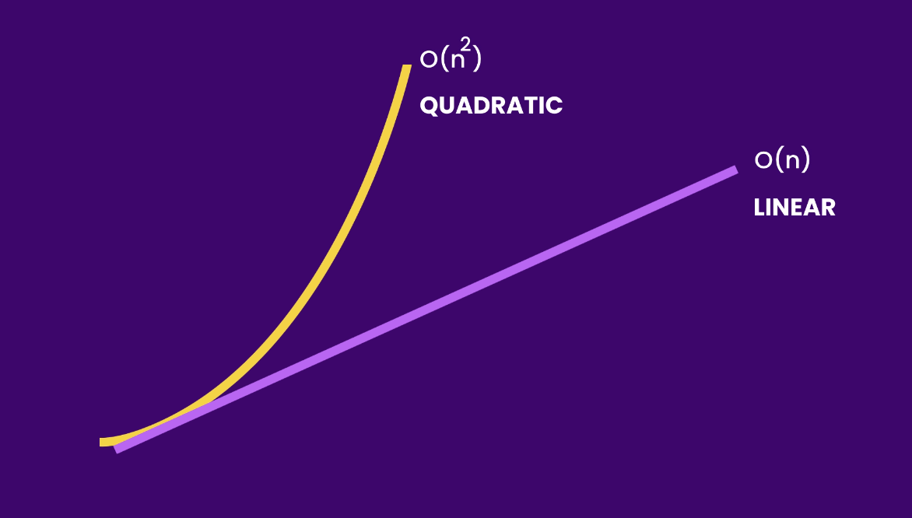
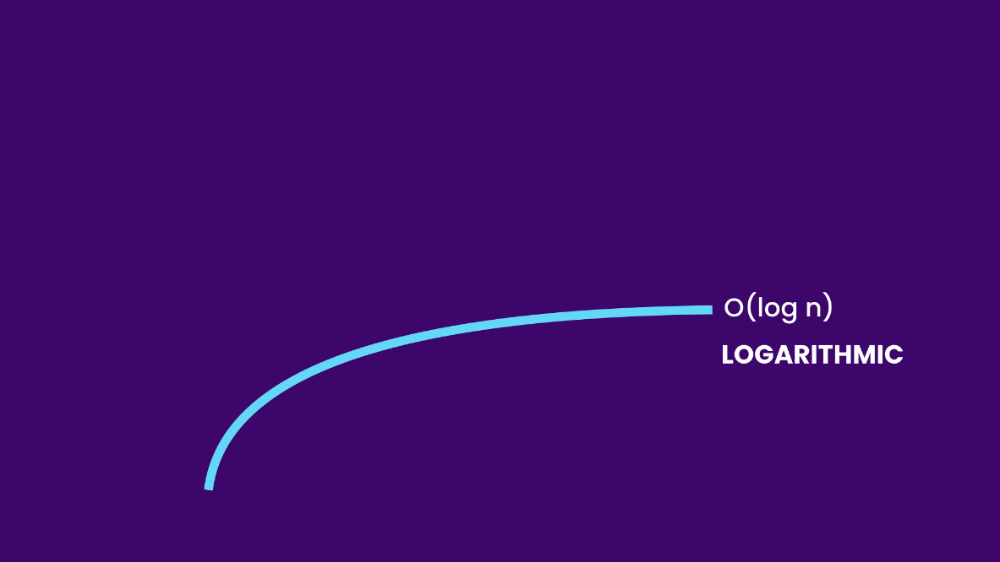
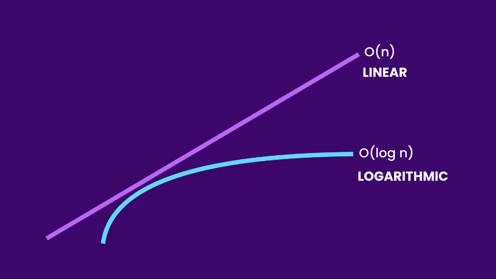
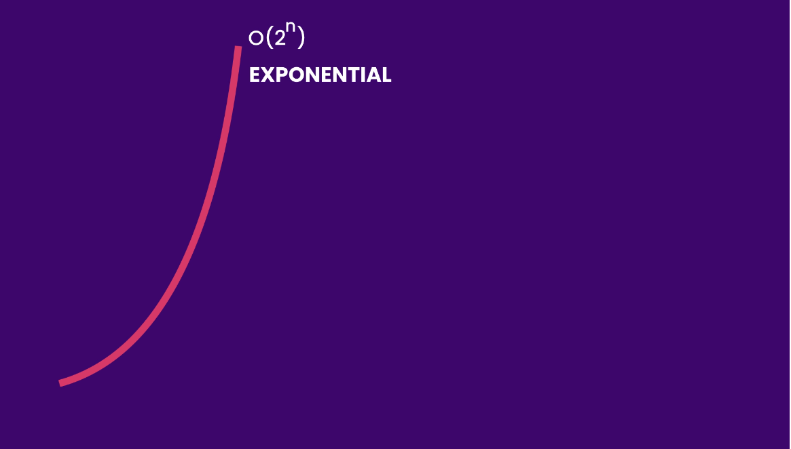
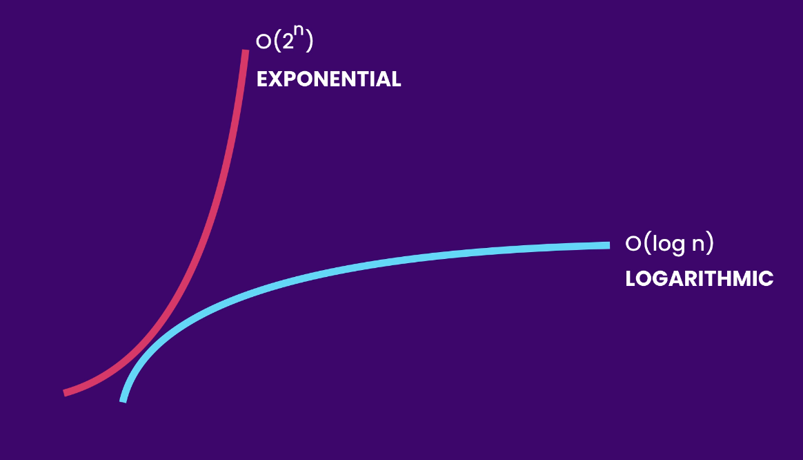
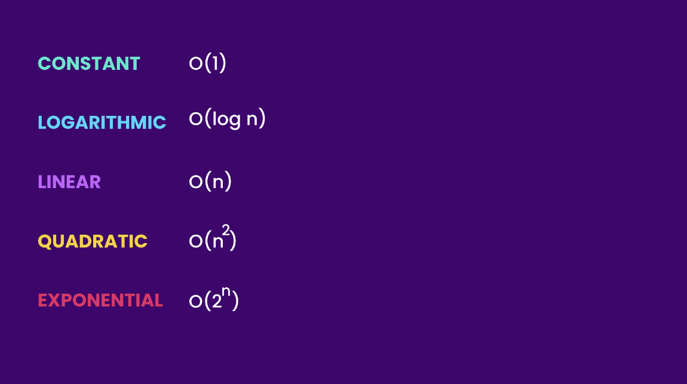
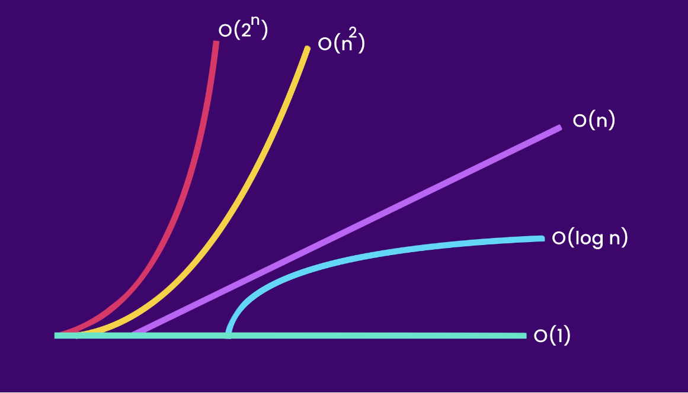

+++
title = "Big O Notation: Understanding Algorithmic Efficiency"
date = 2024-02-10T17:00:45+03:00
draft = false
tags = ["data-structures-and-algorithms", "big-o-notation", "java"]
series = ["Data Structures and Algorithms"]
series_order = 1
+++

## Introduction

Big O notation is a mathematical tool that helps describe the limiting behavior of a function as its input approaches infinity. It is commonly used in computer science to analyze and compare the efficiency of algorithms. In this article, we will explore the basics of Big O notation and its application in understanding algorithmic performance.

## Understanding Big O Notation

Big O notation, denoted as `O(f(n))`, provides an upper bound on the growth rate of a function concerning the size of its input. In simpler terms, it describes how the runtime or space requirements of an algorithm scale with the size of the input.

## O(1) - Constant Time Complexity

Consider the following Java snippet:

```java
public class Main {
    public void log(int[] numbers) {
        // O(1)
        System.out.println(numbers[0]);
    }
}
```

This snippet has a constant time complexity `O(1)` because the execution time remains constant regardless of the size of the input array. Adding more print statements or operations within the method does not change its constant time nature.

```java
public class Main {
    public void log(int[] numbers) {
        // O(2)
        System.out.println(numbers[0]);
        System.out.println(numbers[0]);
    }
}
```

We have two operations, both running in constant time, so the runtime complexity of the method is still `O(1)`. In this method, the size
of the input does not matter; the method will always execute in constant time.

## O(n) - Linear Time Complexity

Linear time complexity, denoted as `O(n)`, describes algorithms whose runtime grows proportionally with the size of the input. Let's explore some examples to better understand this concept.

### Basic Linear Operation

Consider the following Java code:

```java
public class Main {
    public void log(int[] numbers) {
        // O(n)
        for (int i = 0; i < numbers.length; i++)
            System.out.println(numbers[i]);
    }
}
```

In this example, the method iterates through each element in the `numbers` array, and the time complexity is linear `O(n)`. The larger the input array, the longer the runtime.

### Constant-Time Operations in Linear Context

Now, let's examine a scenario where we add constant-time operations before and after the loop:

```java
public class Main {
    public void log(int[] numbers) {
        // O(1 + n + 1) -> O(2+n) -> O(n)
        System.out.println(); // O(1)
        for (int i = 0; i < numbers.length; i++) // O(n)
            System.out.println(numbers[i]);
        System.out.println(); // O(1)
    }
}
```

Despite the added constant-time operations, the overall time complexity remains `O(n)`. This illustrates the principle that constants are typically dropped in Big O analysis.

### Multiple Linear Loops

Let's consider a scenario with two loops:

```java
public class Main {
    public void log(int[] numbers) {
        // O(n + n) -> O(2n) -> O(n)
        for (int number : numbers) // O(n)
            System.out.println(number);

        for (int number : numbers) // O(n)
            System.out.println(number);
    }
}
```

The presence of two linear operations still results in linear time complexity `O(n)`, as constants are dropped in Big O notation.

### Linear Time Complexity with Multiple Parameters

Adding more parameters to a method does not change its fundamental linear time complexity:

```java
public class Main {
    public void log(int[] numbers, String[] names) {
        // O(n + m) -> O(n)
        for (int number : numbers) // O(n)
            System.out.println(number);

        for (String name : names) // O(m)
            System.out.println(name);
    }
}
```

In this case, the overall runtime complexity is `O(n)`, as we focus on the parameter that has linear growth.

## O(n<sup>2</sup>) - Quadratic Time Complexity

Quadratic time complexity, denoted as `O(n²)`, characterizes algorithms that exhibit a growth rate proportional to the square of the input size. This often occurs with nested loops, where each iteration contributes to the overall growth. Let's delve into examples to gain a clearer understanding.

### Nested Loop Scenario

Consider the following Java code:

```java
public class Main {
    public void log(int[] numbers) {
        // O(n * n) -> O(n^2)
        for (int first : numbers) // O(n)
            for (int second : numbers) // O(n)
                System.out.println(first + ", " + second);
    }
}
```

In this example, the outer loop iterates through each element in the `numbers` array, and for each iteration of the outer loop, the inner loop also traverses the entire array. The result is a quadratic time complexity of `O(n²)`.



Algorithms that run in `O(n²)` run slower than algorithms that run in `O(n)`

### Additional Operations in Quadratic Context

Let's examine a scenario where we have additional operations before or after the nested loop:

```java
public class Main {
    public void log(int[] numbers) {
        // O(n + n^2) -> O(n^2)
        for (int number : numbers) // O(n)
            System.out.println(number);

        for (int first : numbers) // O(n)
            for (int second : numbers) // O(n)
                System.out.println(first + ", " + second);
    }
}
```

In this example, the first loop has a time complexity of `O(n)` as it iterates through each element in the `numbers` array. The nested loop, however, has a quadratic time complexity of `O(n²)`, as it iterates through each combination of elements in the array. When we express the overall time complexity as `O(n + n²)`, we recognize that the dominant factor is the quadratic term `n²`.

The rationale for dropping the linear term `n` is rooted in the principle of Big O notation, where we focus on the dominant term that contributes the most to the growth rate. In this context, as the size of the input `n` becomes larger, the impact of the quadratic term `n²` becomes significantly more substantial, overshadowing the linear term. Therefore, for the purpose of understanding how the cost of the algorithm increases relative to its input size, we simplify the expression to `O(n²)`.

### Impact of Nested Loops on Growth Rate

What if we had nested loops within the original nested loop:

```java
public class Main {
    public void log(int[] numbers) {
        // O(n * n * n) -> O(n^3)
        for (int first : numbers) // O(n)
            for (int second : numbers) // O(n)
                for (int third : numbers) // O(n)
                    System.out.println(first + ", " + second + ", " + third);
    }
}
```

In this case, the time complexity becomes cubic `O(n³)`, showcasing how the growth rate accelerates with additional nested loops.

Algorithms that run in `O(n³)` are far slower than those that run in `O(n²)` and `O(n)`. The exponential increase in computational cost makes algorithms with cubic time complexity less scalable and less efficient compared to their quadratic and linear counterparts. This underscores the importance of considering the time complexity when designing algorithms for optimal performance.

## O(log n) - Logarithmic Time Complexity

Another growth rate we are going to talk about is the logarithmic growth, denoted as `O(log n)`. Here is a logarithmic curve for better visualization:



Compare it with a linear curve:



The linear curve grows at the same rate, while the logarithmic curve slows down at some point. An algorithm that runs in logarithmic time is more efficient and more scalable than an algorithm that runs in linear or quadratic time.

### Example

Let's consider an algorithm with logarithmic time complexity:

Assuming we have an array of sorted numbers from 1 to 10 and we want to find the number 10. We can implement the Binary Search algorithm, which runs in logarithmic time.

```java
public class Main {
    public int binarySearch(int[] sortedArray, int target) {
        int low = 0;
        int high = sortedArray.length - 1;

        while (low <= high) {
            int mid = (low + high) / 2;

            if (sortedArray[mid] == target) {
                return mid; // Target found
            } else if (sortedArray[mid] < target) {
                low = mid + 1; // Search in the right half
            } else {
                high = mid - 1; // Search in the left half
            }
        }

        return -1; // Target not found
    }
}
```

In this example, the Binary Search algorithm efficiently narrows down the search space in each iteration. The key advantage comes from the fact that it operates on a sorted array. By continually halving the search space, it minimizes the number of comparisons needed to find the target element. In contrast, a linear search would require iterating through all items in the array, and in the worst case scenario, the target item could be the last element. This linear approach becomes increasingly inefficient as the size of the dataset grows.

The logarithmic time complexity `O(log n)` of the Binary Search algorithm makes it significantly more efficient, especially when dealing with large datasets, as it avoids unnecessary iterations and quickly converges to the target element.

## O(2<sup>n</sup>) - Exponential Time Complexity

Another type of growth is exponential growth, denoted as `O(2ⁿ)`.



The exponential growth is the opposite of logarithmic growth, where the curve grows faster and faster.



The logarithmic curve slows down as the input size grows, but the exponential curve grows faster and faster. An algorithm that runs in exponential time is not scalable and would become very slow very soon.

### Example

Let's explore an algorithm with exponential time complexity:

```java
public class Main {
    public int fibonacci(int n) {
        if (n <= 1) {
            return n;
        } else {
            return fibonacci(n - 1) + fibonacci(n - 2);
        }
    }
}
```

In this example, the Fibonacci algorithm, which calculates Fibonacci numbers recursively, exhibits exponential time complexity `O(2ⁿ)`. As the input value increases, the number of recursive calls grows exponentially, leading to a rapid increase in computational cost.

Exponential time complexity is not scalable for large inputs, making algorithms with this complexity impractical for certain applications.

## Space Complexity

We've seen how Big O Notation helps describe the runtime complexity of algorithms. Ideally, we want our algorithms to be fast, scalable, and use minimal memory. However, this ideal is rarely achieved. Most often, we must make trade-offs between saving time and saving space.

Sometimes we have extra space, allowing us to optimize algorithms for speed and scalability. Other times, especially when building apps for small devices, space is limited, and we prioritize optimizing for space over scalability.

So, we need a way to talk about how much space an algorithm requires, and that's where we use the Big O Notation again.

### O(x)

```java
public class Main {
    public void greet(String[] names) {
        // O(1) space
        for (int i = 0; i < names.length; i++)
            System.out.println("Hi" + names[i]);
    }
}
```

In this `greet` method, the loop variable `i` is independent of the size of the input. Whether the array has 10 or a million items, the method will only allocate a constant amount of memory for the loop variable, representing `O(1)` space complexity.

What if we declare a copy string array and initialize it as shown below:

```java
public class Main {
    public void greet(String[] names) {
        // O(n) space
        String[] copy = new String[names.length];

        for (int i = 0; i < names.length; i++)
            copy[i] = names[i];
    }
}
```

## Conclusion

The growth rates we've explored are common in algorithmic analysis. While they represent just a subset of possibilities, they capture scenarios frequently encountered.





In this series, we'll mainly focus on runtime complexity, tackling its intricate aspects. Nevertheless, it's crucial to also consider space complexity in your algorithms, especially in situations where memory is limited. As you navigate algorithmic challenges, think creatively about preserving memory.

## References

- Mosh Hamedani. [Ultimate Data Structures & Algorithms: Part 1](https://codewithmosh.com/p/data-structures-algorithms-part1)
- [Wikipedia - Big O Notation](https://en.wikipedia.org/wiki/Big_O_notation)
