+++
title = "Linked Lists Data Structure"
date = 2024-02-20T11:11:59+03:00
draft = false
tags = ["data-structures-and-algorithms", "linked-lists", "java"]
series = ["Data Structures and Algorithms"]
series_order = 3
+++

## Introduction

Linked lists provide a dynamic way of storing and managing data, allowing for automatic growth and shrinkage. Unlike arrays, linked lists consist of nodes, each holding a value and a reference to the next node in the sequence.

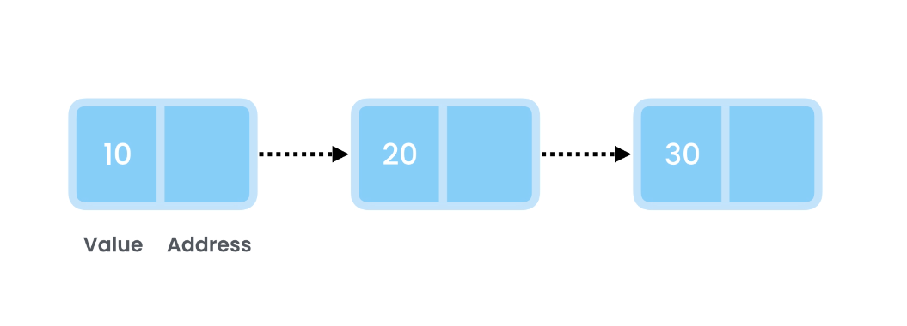

The initial node is termed the `Head`, and the final one is the `Tail`.

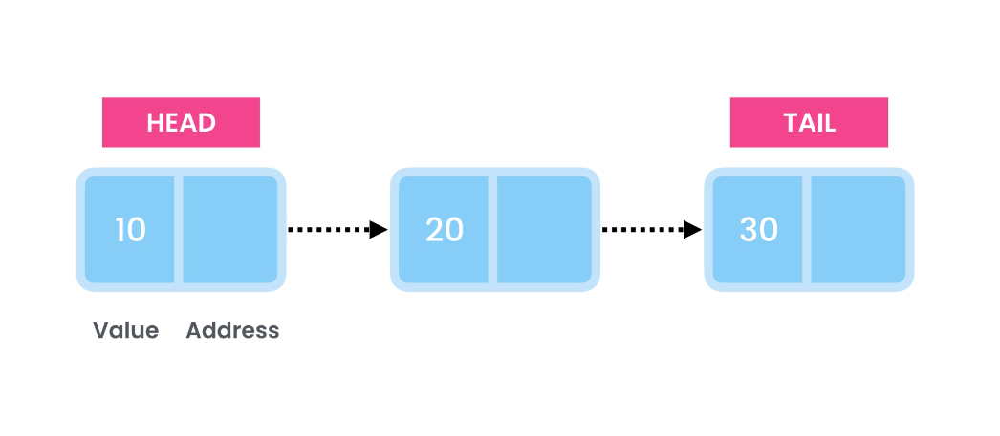

## Time Complexity Analysis

Let's examine the time complexity of various operations:

### 1. **Search Operation :**

To find out if a list contains a given number, we have to traverse the list from `Head` to `Tail` which results in a time complexity of `O(n)`.

### 2. **Index-based Lookup:**

Due to the non-sequential nature of linked list nodes in memory, searching by index also takes `O(n)` time.

### 3. **Insertions:**

##### <u>Inserting at the End</u>

To add a new item at the end of the linked list, we create a new node and have the `Tail` reference it.

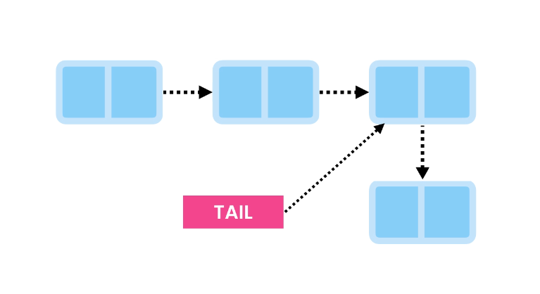

Now, we update the `Tail` to point to the new node.

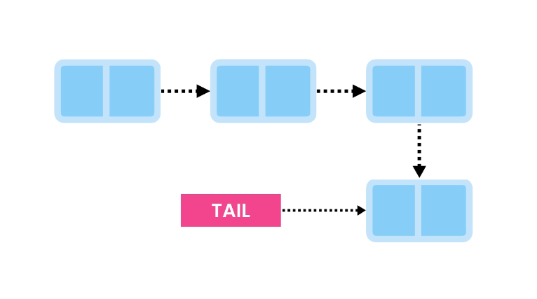

This operation is efficient with a time complexity of `O(1)`.

##### <u>Inserting at the Beginning</u>

Adding a new item at the beginning is equally fast. With a reference to the `Head`, we create a new node and link it to the first node.

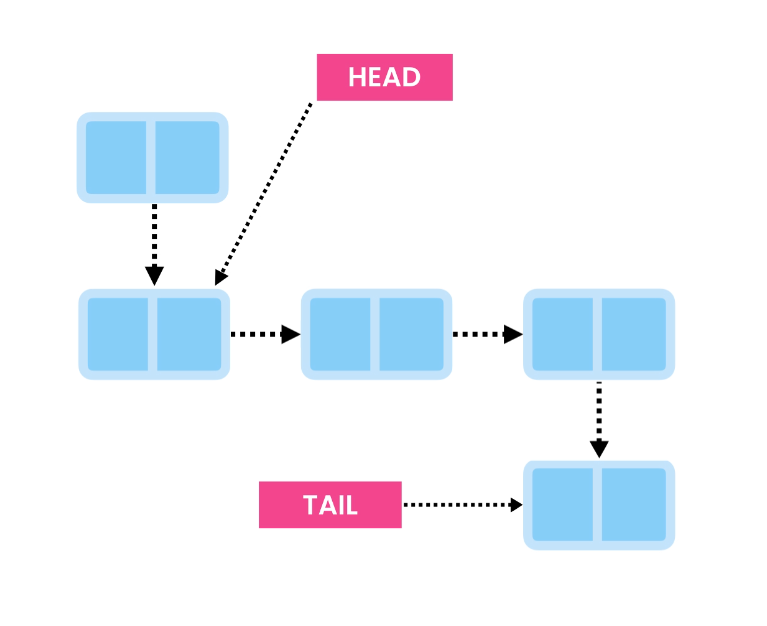

Then, we update the `Head` to point to the new node.

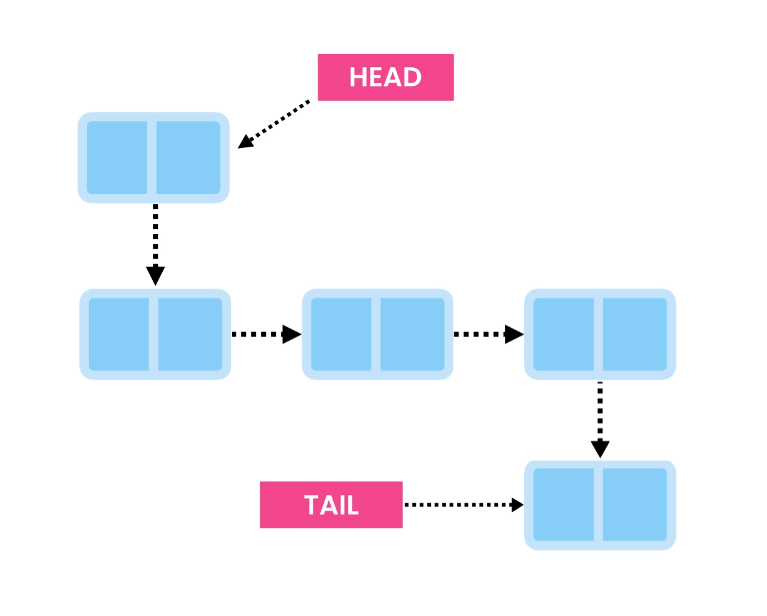

This operation is swift, just like inserting at the end, with a time complexity of `O(1)`.

##### <u>Inserting in the Middle</u>

If we wish to insert an item after a specific node, like the tenth node, we first traverse to find that node `O(n)`, then update the links `O(1)` which results to `O(n)`.

### 4. **Deletions:**

##### <u>Deleting from the Beginning</u>

Removing the first item is a quick `O(1)` operation. We simply update the `Head` to point to the second node.


Then, we remove the link from the previous `Head` so that it doesn't reference the second node anymore.

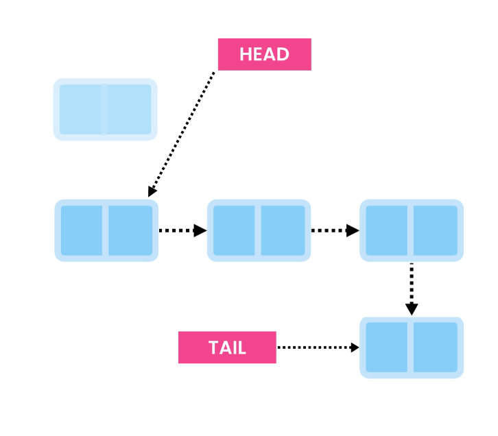

##### <u>Deleting from the End</u>

Deleting the last item is a bit more involved. We traverse the list to find the second-to-last node, keep a reference to it, and unlink it from the last node.


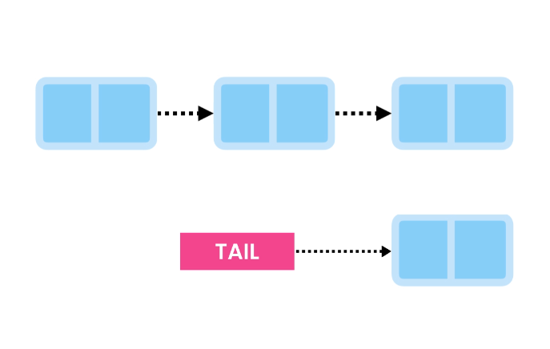

Finally, we have the `Tail` point to the second-to-last node.

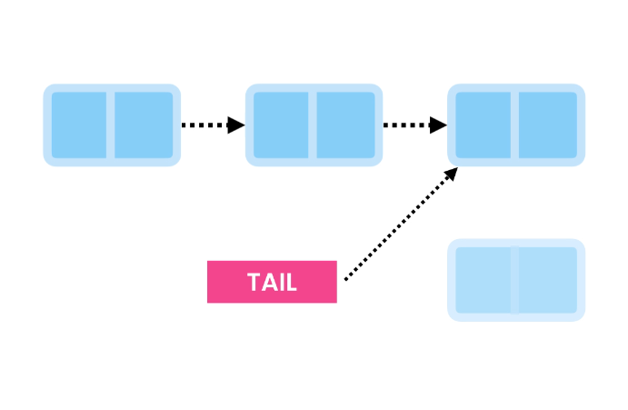

This operation has a time complexity of `O(n)`.

##### <u>Deleting from the Middle</u>

Deleting from the middle requires traversing to find the node and its previous node. We link the previous node to the next node, then remove the links on the node we're deleting.

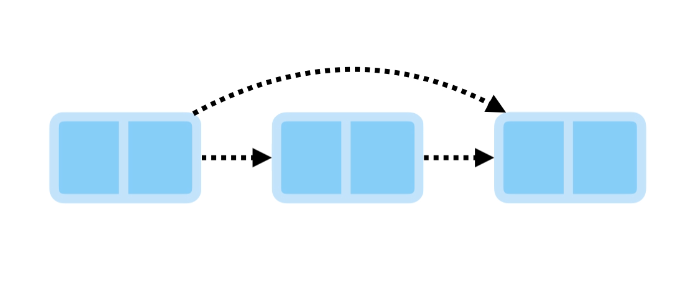

Finally, we remove the links on the node we're deleting, ensuring it can be cleared from memory.

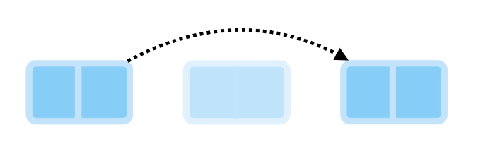

This operation also has a time complexity of `O(n)`.

## Working with Linked Lists in Java

Now, let's explore working with linked lists in Java using the `LinkedList` class from `java.util`. This class allows for generic data storage.

```java
import java.util.LinkedList;

public class Main {
    public static void main(String[] args) {
        // Initialize the linked list
        LinkedList<Integer> list = new LinkedList<>();

        // Add items to the end
        list.addLast(10);
        list.addLast(20);
        list.addLast(30);
        System.out.println(list); // Output: [10, 20, 30]

        // Add at the beginning
        list.addFirst(5);
        System.out.println(list); // Output: [5, 10, 20, 30]

        // Remove the last item
        list.removeLast();

        // Remove the first item
        list.removeFirst();

        // Remove item with index
        list.remove(1);

        // Check if list contains a given item
        System.out.println(list.contains(10)); // Output: true

        // Get the index of the first occurence of an item
        System.out.println(list.indexOf(10)); // Output: 0

        // Get the index of the last occurence of an item
        list.addLast(10);
        System.out.println(list.lastIndexOf(10)); // Output: 1

        // Get the size of the list
        System.out.println(list.Size()); // Output: 2

        // Convert the Linked list to an Array
        list.toArray();
    }
}
```

Don’t let the output fool you, it looks like any array, but we are actually dealing with a linked list and not an array.

## Exercise 1: Creating a Linked List

To gain a deeper understanding of linked lists, let's implement a linked list from scratch. We'll need two classes:

1. `Node` class:

   - Fields: `value` (int), `next` (Node)

2. `LinkedList` class:

   - Fields: `first` (Node), `last` (Node)
   - Methods: `addFirst`, `addLast`, `deleteFirst`, `deleteLast`, `contains`, `indexOf`

### Implementing the LinkedList

```java
import java.util.NoSuchElementException;

public class LinkedList {
    // Node class encapsulates details of the nodes
    private class Node {
        private int value;
        private Node next;

        // Constructor ensures a node must have a value
        public Node(int value) {
            this.value = value;
        }
    }

    private Node first; // Head of the linked list
    private Node last;  // Tail of the linked list
    private int size;    // Track the number of nodes in the list

    // Add a new node at the end of the linked list
    public void addLast(int item) {
        var node = new Node(item);

        // Check if the list is empty
        if (isEmpty()) {
            first = last = node;
        } else {
            last.next = node;
            last = node;
        }

        size++;
    }

    // Add a new node at the beginning of the linked list
    public void addFirst(int item) {
        var node = new Node(item);

        // Check if the list is empty
        if (isEmpty()) {
            first = last = node;
        } else {
            node.next = first;
            first = node;
        }

        size++;
    }

    // Check if the list is empty
    private boolean isEmpty() {
        return first == null;
    }

    // Return the index of the first occurrence of a node with a value equal to the given item
    public int indexOf(int item) {
        int index = 0;
        var current = first;

        while (current != null) {
            if (current.value == item)
                return index;
            current = current.next;
            index++;
        }
        return -1;
    }

    // Return true if a node exists with a value equal to the given item
    public boolean contains(int item) {
        return indexOf(item) != -1;
    }

    // Remove the first node of the linked list
    public void removeFirst() {
        if (isEmpty())
            throw new NoSuchElementException();

        if (first == last)
            first = last = null;
        else {
            var second = first.next;
            first.next = null;
            first = second;
        }

        size--;
    }

    // Remove the last node of the linked list
    public void removeLast() {
        if (isEmpty())
            throw new NoSuchElementException();

        if (first == last)
            first = last = null;
        else {
            var previous = getPrevious(last);
            last = previous;
            last.next = null;
        }

        size--;
    }

    // Return the node before the given node (parent node)
    private Node getPrevious(Node node) {
        var current = first;

        while (current != null) {
            if (current.next == node)
                return current;
            current = current.next;
        }
        return null;
    }

    // Return the size of the linked list (number of nodes in the list)
    public int size() {
        return size;
    }

    // Return an array of the values stored in the nodes
    public int[] toArray() {
        int[] array = new int[size];
        var current = first;
        var index = 0;

        while (current != null) {
            array[index++] = current.value;
            current = current.next;
        }

        return array;
    }
}
```

### Testing the implementation

```java
import java.util.Arrays;

public class Main {
    public static void main(String[] args) {
        var list = new LinkedList();

        // Adding items to the end of the list
        list.addLast(10);
        list.addLast(20);
        list.addLast(30);

        // Adding an item to the beginning of the list
        list.addFirst(5);

        // Checking the index of an item, for example, 30:
        System.out.println(list.indexOf(30)); // Output: 3

        // Checking the index of an item that is not in the list:
        System.out.println(list.indexOf(100)); // Output: -1

        // Checking if the list contains a node with a given value
        System.out.println(list.contains(5)); // Output: true

        // Removing the first item from the list
        list.removeFirst();

        // Removing the last item from the list
        list.removeLast();

        // Getting the size of the list
        System.out.println(list.size()); // Output: 2

        // Converting the list to an array
        var array = list.toArray();
        System.out.println(Arrays.toString(array)); // Output: [10, 20]
    }
}
```

## Arrays vs Linked Lists

A common interview question involves comparing arrays and linked lists. Differences in terms of required memory and time complexity of various operations are summarized below.

**Space**

- Static arrays have a fixed size.
- Dynamic arrays grow by 50-100% when full, potentially wasting memory.
- Linked lists take only the necessary memory but require extra space for node references.

**Runtime Complexity**



| Operation          | Arrays | Linked Lists |
| ------------------ | ------ | ------------ |
| Lookup by Index    | O(1)   | O(n)         |
| Lookup by Value    | O(n)   | O(n)         |
| Insert at End      | O(1)   | O(1)         |
| Insert at Start    | O(n)   | O(1)         |
| Insert in Middle   | O(n)   | O(n)         |
| Delete from Start  | O(n)   | O(1)         |
| Delete from End    | O(1)   | O(n)         |
| Delete from Middle | O(n)   | O(n)         |



## Types of Linked Lists

There are two main types of linked lists: singly and doubly linked lists.

**Singly Linked List**

In singly linked list, each node references the next node in the sequence.

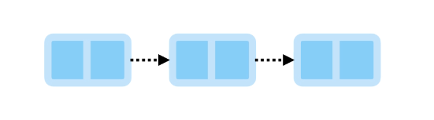

**Doubly Linked List**

In doubly linked list, each node has references to both the next and previous nodes.


**Circular Linked List**

Both singly and doubly linked lists can be circular, where the last node references the first node.

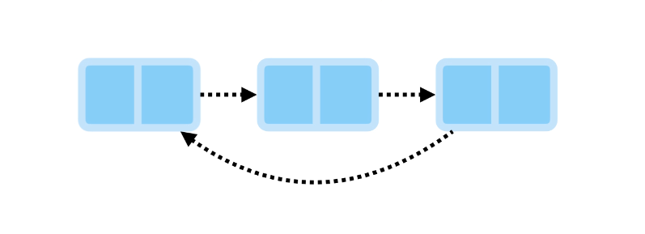

## Exercise2: Reversing a Linked List

One common interview question involves reversing a linked list in place. Let me illustrate this concept. Consider a linked list shown below:

```
[10 -> 20 -> 30]
```

To reverse it, we need to change the direction of these links:

```
[10 <- 20 <- 30] => [30 -> 20 -> 10]
```

Here, `30` becomes the new `Head`, and `10` becomes the new `Tail`.

### Solution Algorithm Design

We will start from the beginning, utilizing two variables/references: `previous` and `current`. In the first iteration, `previous` points to the first node, and `current` references the second node.

```
[10 -> 20 -> 30]
 p     c
```

To alter the link between `p` and `c`, we can use `c.next = p`. After executing that, the link between 20 and 30 is removed, and now 20 references 10.

```
[10 <- 20  30]
 p      c
```

In the second iteration, we work with the second and third nodes. However, after executing `c.next = p`, we lose track of 30 because we no longer have a reference to it from 20. To address this, we store a reference to 30 as a backup before executing the statement `c.next = p`.

```
[10 -> 20 ->  30]
 p      c

n = c.next
c.next = p

[10 <- 20  30]
  p    c    n
```

After these two steps, we are ready to move one step forward. Now our pointers/references look like this:

```
[10 <- 20  30]
       p   c   n
```

Once again, we make `current` reference `previous` using `c.next = p`, and since there is no next node after `current` (as `current` is currently referencing the last node), `next` will be `null`.

```
[10 <- 20 <- 30]
       p     c    n
```

Now, `30` references `20`. We are ready to move one step forward. `previous` references `30`, while `current` and `next` reference `null`. This is when we stop, i.e., when `current` references `null`.

```
[10 <- 20 <- 30]
             p    c    n
```

This process effectively reverses the linked list in place.

### Implementing Solution in Code

After formulating an efficient algorithm to reverse a linked list, let's now bring our solution to life in code. We'll be integrating a `reverse()` method into our `LinkedList` class, as illustrated in the snippet below.

```java
public class LinkedList {
    // Previous code

    // Reverses the order of the linked list in-place.
    public void reverse() {
        if (isEmpty())
            return;

        // Initialize pointers for traversing and reversing
        var previous = first;
        var current = first;

        // Traverse the list and reverse the order
        while(current != null) {
            var next = current.next; // Backup the reference to the next node
            current.next = previous; // Reverse the link, making current point to the previous node
            previous = current;      // Move the previous pointer forward to the current node
            current = next;          // Move the current pointer forward to the next node (using the backup)
        }

        last = first;              // Update the Tail to point to the previous Head
        last.next = null;          // Ensure Tail doesn't have a next node (end of the reversed list)

        first = previous;           // Update Head to point to the previous pointer (former Tail)
    }
}
```

**Testing in Main**

```java
import java.util.Arrays;

public class Main {
  public static void main(String[] args) {
    var list = new LinkedList();
    list.addLast(10);
    list.addLast(20);
    list.addLast(30);
    list.reverse();
    var array = list.toArray();
    System.out.println(Arrays.toString(array)); // Output: [30, 20, 10]
  }
}
```

## Exercise3: Find Kth Node from End

Let's delve into another common interview question: "Find the Kth node from the end of a linked list in one pass." Consider the following linked list as an example:

`[10 -> 20 -> 30 -> 40 -> 50]`

For various values of K:

- K = 1 (Output: 50)
- K = 2 (Output: 40)
- K = 3 (Output: 30)

When tackling such questions, start by simplifying them. Instead of aiming to find the Kth node from the end, try to solve a specific instance, such as the 3rd node from the end. Once you solve this, you can then generalize your algorithm.

### Formulating Solution

The trick in this question is to find the target node in one pass, and a handy approach involves using two pointers, each pointing to different nodes in the linked list. For instance, we can initialize two pointers to point at nodes 10 and 30:

```
[10 -> 20 -> 30 -> 40 -> 50]
 *           *
```

Now, move these two pointers until the last pointer points to the last node:

```
[10 -> 20 -> 30 -> 40 -> 50]
             *           *
```

Stop at this point, and the first pointer will be pointing at the target node. To generalize, for finding the Kth node from the end, set the distance between the two pointers to be `K - 1` nodes.

### Code Implementation

```java
public class LinkedList {
    // Previous code

    // Finds and returns the value of the Kth node from the end of the linked list
    public int getKthFromEnd(int k) {
        // Check if the list is empty
        if (isEmpty()) {
            throw new IllegalStateException("Cannot find Kth node in an empty list.");
        }

        // Initialize two pointers to track the Kth node
        var firstPointer = first;
        var secondPointer = first;

        // Move the second pointer to the right distance from the first node
        for (int i = 0; i < k - 1; i++) {
            secondPointer = secondPointer.next;

            // Check if the value of k is larger than the actual size of the linked list
            if (secondPointer == null) {
                throw new IllegalArgumentException("The value of k is larger than the actual size of the linked list.");
            }
        }

        // Move both pointers together until the second pointer reaches the last node
        while (secondPointer != last) {
            firstPointer = firstPointer.next;
            secondPointer = secondPointer.next;
        }

        // Return the value of the target node
        return firstPointer.value;
    }
}
```

**Testing the Implementation**

```java
public class Main {
    public static void main(String[] args) {
        var list = new LinkedList();
        list.addLast(10);
        list.addLast(20);
        list.addLast(30);
        list.addLast(40);
        list.addLast(50);
        System.out.println(list.getKthFromEnd(3)); // Output: 30
    }
}
```

## Summary

Let's quickly recap the key points we have learned about linked lists.

- Linked lists are the second most used data structures after arrays.
- Unlike arrays, they grow and shrink automatically without wasting memory.
- They take a bit more memory because each node should have a reference to the next and/or previous node.

**Runtime Complexities**

- **Lookup**
  - By Index: O(n)
  - By Value: O(n)
- **Insert**
  - Beginning/End: O(1)
  - Middle: O(n)
- **Delete**
  - Beginning: O(1)
  - Middle: O(n)
  - End: O(n) in singly-linked list / O(1) in doubly-linked lists

## Conclusion

Linked lists are powerful data structures with distinct advantages, providing flexibility in memory management compared to arrays. Their dynamic resizing capabilities make them ideal for scenarios where the size of the data structure may vary over time.

However, it's crucial to consider the trade-offs. Linked lists incur a slightly higher memory cost due to node references, and certain operations, such as random access, can have higher time complexities compared to arrays.

## References

- Mosh Hamedani. [Ultimate Data Structures & Algorithms: Part 1](https://codewithmosh.com/p/data-structures-algorithms-part1)
